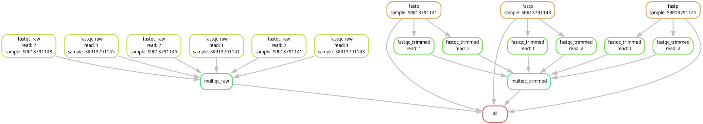

# Pipeline RNAseq — Contrôle traductionnel du cortex murin

## Contexte biologique

Ce pipeline analyse l'expression différentielle entre neurones embryonnaires et adultes du cortex murin (Mus musculus GRCm39), dans le cadre de l'étude du contrôle traductionnel médié par les ARNt.

## Architecture du pipeline



## Stack technique

| Étape | Outil | Version |
|-------|-------|---------|
| Contrôle qualité | FastQC + MultiQC | 0.12 / 1.21 |
| Trimming | fastp | 0.23.4 |
| Alignement | STAR | 2.7.11b |
| Comptage | featureCounts | 2.0.6 |
| Expression différentielle | DESeq2 | 1.42.0 |
| Enrichissement fonctionnel | clusterProfiler | 4.10.0 |
| Orchestration | Snakemake | 8.x |

## Données

Dataset : GSE167665 (GEO, NCBI) — cortex murin, stades embryonnaire et adulte.

## Utilisation

```bash
git clone https://github.com/myxcel/pipeline-rnaseq
cd pipeline-rnaseq
conda env create -f envs/qc.yaml
#...
conda env create -f envs/align.yaml
#...
conda env create -f envs/deseq2.yaml
#...
snakemake --use-conda --cores 8
```

## Résultats principaux

[En cours, il faut *beaucoup* de RAM pour l'alignement chez les mammifères...]

